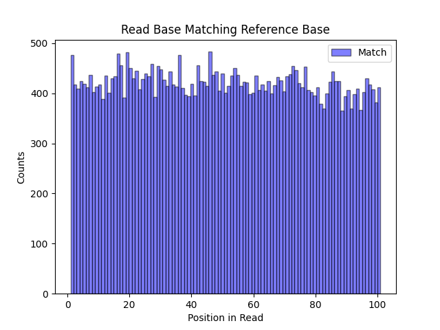
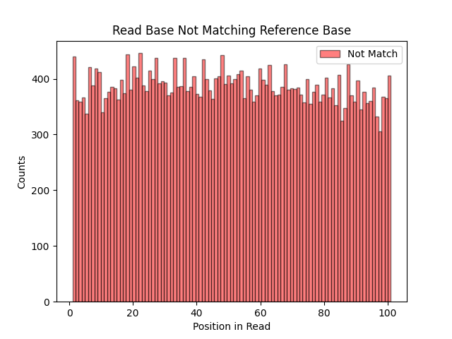
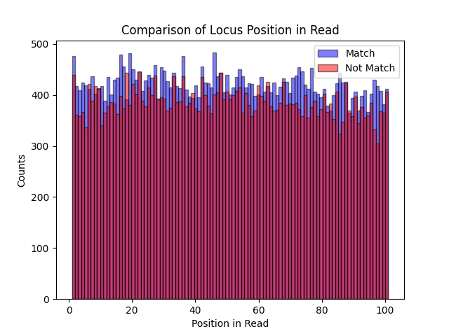
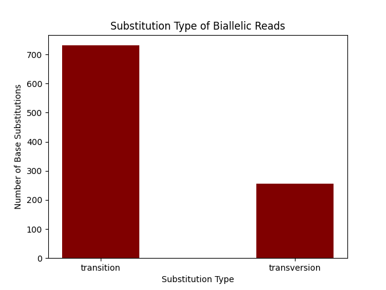

# Variant_Calling_Analysis

Intend to add example of variable_sites.txt file used in script.  
  
## Table of contents
1. [Overview](#overview)
   1. [Repository Description](#repository)
   2. [Script Description](#script)
2. [Dependencies](#dependencies)
3. [How to Run Script](#howto)
4. [Output](#output)
   1. [Part One](#out1)
   2. [Part Two](#out2)
5. [Example Results & Interpretations](#results)

## Overview 
Provided in this repository is example analysis for variant calling when provided a BAM file and text file of loci of interest.  
  
### Repository Description 
The repository includes the following files:  
- README.md: this report in markdown format  
- variant_calling.py: python script performing simple variance analysis at given loci for provided BAM file  
- reads_per_locus.txt: tab delimited results from part one of script  
- biallelic_locus_data.txt: tab delimited results from part two of script  
- position_base_matching_ref_maxbin.png: figure from part three of script showing histogram of distribution of *locus_pos_in_read* for reads where *read_base* matches *locus_base*  
- position_base_not_matching_ref_maxbin.png: figure from part three of script showing histogram of distribution of *locus_pos_in_read* for reads where *read_base* does not match *locus_base*  
- position_base_compare_maxbin.png: figure from part three of script overlapping matching and not matching bases for ease of comparison  
- biallelic_substitution_types.png: figure from part four of script showing barplot of number of transitions vs. number of transversions for biallelic loci  
  
### Script Description 
The script variant_calling.py is structured in four parts, one for each part of the analysis, with leading information to parse inputs and define variables. File inputs do not have to be in working directory. If an index file does not exist for given BAM in same directory as BAM file, the script will make one. Outputs will be returned in working directory.  
  
The first part of the script writes a tab delimited file describing chromosome of locus of interest, position of locus, locus base, read name, read length, CIGAR string, locus position in read (1-based), and read base for all reads that cover each locus of interest in the provided variable_sites.txt file. The second part of the script writes a tab delimited file describing chromosome of locus of interest, position of locus, base of locus on reference, base of locus on read, frequency of reference base on read, frequency of alternative base on read, and substitution type of either transition or transversion for all biallelic loci identified. Part three produces figures showing the position of the locus of interest on each read for read bases that match the reference base, and for read bases that do not match the reference base. Part four produces a figure showing the number of biallelic substitutions that are transitions and the number that are transversions.  

## Dependencies 
The following packages were imported for running the script:  
- sys  
- os  
- argparse (1.1)  
- re (2.2.1)  
- pysam (0.18.0)  
- pandas as pd (1.4.1)  
- matplotlib.pyplot as plt (3.5.1)  
  
Import dependencies of sys and os allow for the python script to interact with the operating environmen. Input arguments are parsed with the argparse package. REGEX is used to parse CIGAR strings with the package re. The BAM file is read and indexed using pysam. Arrays are managed with pandas package. Figures are constructed using matplotlib.  

## How to Run Script 
Running the script requires the two input files, a BAM of chromosomal DNA reference, and a txt file of variable sites . The BAM file input is identified with the "-b" or "--bamfile" flag, and the variable sites file is identified with the "-l" or "--locifile" flag. Both inputs are to be provided as file locataions.  
  
An example command to run script from terminal:  
> python3 variant_calling.py -b /Users/lisa/VarCall/chr2.bam -l /Users/lisa/VarCall/variable_sites.txt

## Output 
Provided here are descriptions for each of the two output txt files requested in the assignment. If no index file exists for given BAM file, the program will also output an index file, named according to the convention bamfilename.bai.  
  
### Part One 
The output to the first part of the script is provided in the file reads_per_locus.txt. The columns of the tab delimited file are as follows:  
1. *locus_chr*: chromosome the locus resides on.  
2. *locus_pos*: position of the locus.  
3. *locus_ref*: reference base of the locus.  
4. *read_name*: name of the read.  
5. *read_len*: length of the read.  
6. *read_cigar_string*: CIGAR string of the read.  
7. *locus_pos_in_read*: position of the locus on the read (1-based).  
8. *read_base*: base on the read at the locus position.  
  
*locus_chr*, *locus_pos*, and *locus_ref* were extracted from the provided variable_sites.txt file, and used as inputs to the pysam package for fetching reads that align with the given locus from a provided BAM file. From the BAM file for each read associated with a given locus, the *read_name*, *read_cigar_string*, read start position, and read sequence were extracted. The *read_len* was calculated from the sequence. The CIGAR string was used to guide navigation from the provided 1-based *locus_ref* and extracted read start position to identify the *locus_pos_in_read*. The calculated *locus_pos_in_read* was then used to identify the *read_base* from the sequence. The output file reflects these variables in the order described above, with header and one row per read.  
  
### Part Two 
The output to the second part of the script is provided in the file biallelic_locus_data.txt. The columns of the tab delimited file are as follows:  
1. *locus_chr*: chromosome of the locus.  
2. *locus_pos*: position of the locus.  
3. *ref_base*: reference base of the locus.  
4. *alt_base*: alternate base of the locus.  
5. *ref_freq*: frequency of reads with the reference base at this position.  
6. *alt_freq*: frequency of reads with the alternate base at this position.  
7. *substitution_type*: transition or a transversion.  
  
The output file from part one was imported into a dataframe using the package pandas to provide inputs for extracting the required information. As in part one, *locus_chr*, *locus_pos*, and *locus_ref* were extracted from the provided variable_sites.txt file. The dataframe of part one results was grouped according to each locus, then each identified *read_base* was grouped and counted. Proceeding for only biallelic loci, each remaining locus used the total number of reads counted and the number of each base counted to calculate *ref_freq* and *alt_freq*. If the unordered set of *ref_base* and *alt_base* were either {"A", "G"}, or {"C", "T"}, the substitution was considered a trasition; otherwise it was considered a transversion. The output file reflects these variables in the order described above, with header and one row per biallelic locus.  
  
## Example Results & Interpretations 
Using the results from part one, which described reads containing variable sites, the 1-based position of the locus within the read was compared for reads where the reference base matched the read base (**Fig.1**) and for when the reference base did not match the read base (**Fig.2**).  
  
|  |
| :-- |
| <b>Fig.1:</b> Histogram showing distribution of 1-based position in read of locus of interest for reads where base at locus was the same as the reference base. |
  
|  |
| :-- |
| <b>Fig.2:</b> Histogram showing distribution of 1-based position in read of locus of interest for reads where base at locus was not the same as the reference base. |
  
From the comparison of distribution of locus position in reads for matched and unmatched bases (**Fig.3**), both sets show that the locus of interest may occur at any position in the read. There is a greater frequency of matched than unmatched bases overall, and at most positions of the read. Positions where there was a greater frequency of unmatched bases would provide good candidates for further consideration to verify the quality score of the read in order to ensure that the alternative allele is a natural variation and not a read or duplication error. Having a flat distribution of locus position in the reads indicates that the mapped short reads start and stop at a variety of positions, providing good coverage of the reference sequence.    
  
|  |
| :-- |
| <b>Fig.3:</b> Histogram showing distribution of 1-based position in read of locus of interest for all reads, comparing matched to unmatched with reference base. |
  
The results from part two of the script were used to compare transition and transversion substitution types for biallelic loci (**Fig.4**). A transition is considered a substitution between like types of nucleobases, that is both purines (A and G), or both pyrimidines (C and T). A transversion is a substitution that changes from a purine and a pyrimidine, or vice versa. In the dataset provided, transitions are much more common than transversions. This is as expected because purines are double ring structures and pyrimidines are single ring structures. The result of the different size of purines and pyrimidines is that a transition substitution uses an alternate base of the same size as the reference base, but a transversion uses an alternate base of a different size. Transversions are expected to be less likely because the change in size of the base can distort the shape of the DNA at a locus, which can impact the condensing behaviour, or interactions with other proteins. This dataset reflected the biological expectation that transitions would be more common in biallelic loci.  
  
|  |
| :-- |
| <b>Fig.4:</b> Barplot of transition and transversion occurences at biallelic loci. |
  
